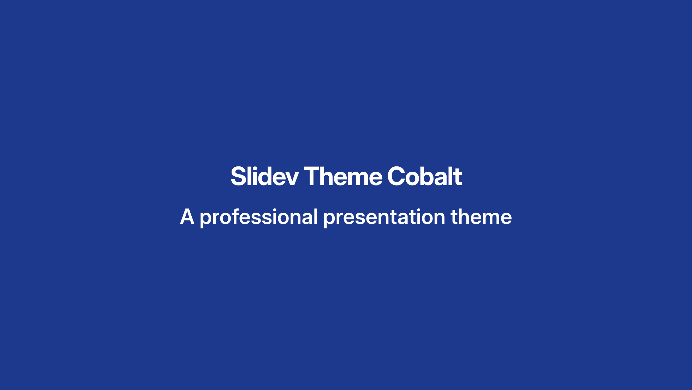
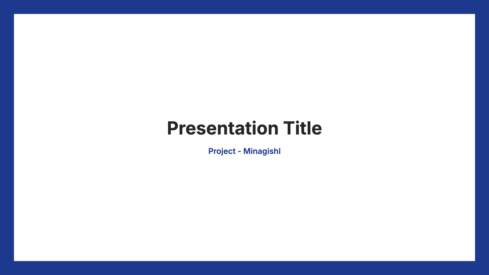

# Slidev Theme Cobalt

A Slidev theme featuring a deep cobalt blue color scheme with framed layouts, inspired by the v2.0 slide template.

## Preview

<table>
<tr>
<td align="center">
  
  <br/>
  <sub>Cover Layout</sub>
</td>
<td align="center">
  
  <br/>
  <sub>Title Center Layout</sub>
</td>
</tr>
</table>

## Live Demo

| Mode       | URL                                     |
| ---------- | --------------------------------------- |
| Slide Show | https://cobalt.minagishl.com            |
| Presenter  | https://cobalt.minagishl.com/presenter/ |

## Install

Add the following frontmatter to your `slides.md`:

```
---
theme: cobalt
---
```

When you run Slidev, it will automatically install the `slidev-theme-cobalt` package.

Learn more about how to use a theme in the Slidev docs.

## Layouts

This theme provides the following layouts:

- `cover` - Full blue cover slide with centered content
- `title` - Left-aligned title on framed slide
- `title-center` - Centered title on framed slide
- `title-sandwich` - Three-part layout with top subtitle, centered title, and bottom footer
- `intro` - Centered content on framed slide (similar to title-center)
- `toc` - Table of contents with numbered badges
- `section` - Full blue section divider
- `section-frame` - Framed section divider with white background
- `panel` - Light gray panel on white background for quotes and content
- `team` - Panel layout for three team members with images
- `team-border` - Team layout with blue border frame
- `steps-layout` - Vertical or 2-column step list layout (use `.steps-column`, `.step`, `.step-header`, `.step-number`, `.step-title`, `.step-body`)
- `process-flow` - Horizontal process flow with circular steps and connecting arrows (use `.process-flow-container`, `.process-step`, `.process-step-circle`, `.process-step-title`, `.process-step-description`, `.process-arrow`)
- `table` - Framed table-focused layout for feature comparison or data overview slides
- `two-cols` - Two equal columns for side-by-side content (use `.two-cols-col` divs for each column)
- `profile` - Framed profile/text pages with header
- `frame-panel` - Framed slide with inner panel and header
- `image-left` - Left image and right text (use `image-col` and `content-col` divs)
- `image-right` - Right image and left text (use `image-col` and `content-col` divs)

## Components

No custom components are required. Use the utility classes in `styles/layout.css` such as:

- `text-blue` - Emphasized blue text
- `quote` - Larger quote text in blue or black
- `member` / `name` - Team member blocks and names
- `steps-column`, `step`, `step-header`, `step-number`, `step-title`, `step-body` - For structuring step-by-step slides with `steps-layout`
- `process-flow-container`, `process-step`, `process-step-circle`, `process-step-title`, `process-step-description`, `process-arrow` - For horizontal process flow diagrams with `process-flow`
- `table-layout` with native Markdown tables or HTML `<table>` elements - For clean, full-width tables with zebra stripes and hover states
- `two-cols-col` - For each column in the `two-cols` layout (wrap content in two divs with this class)

## Features

- **Deep Cobalt Blue**: Rich blue color palette (`oklch(37.9% 0.146 265.522)`) for professional presentations
- **Framed Layouts**: Elegant blue frames surrounding white content areas
- **Japanese Support**: Includes Noto Sans JP font for Japanese text
- **Multiple Layouts**: 18 layout options for various presentation needs

## Deploy (Cloudflare Workers)

You can deploy the built slides as static assets to Cloudflare Workers.

1. Log in at [Cloudflare](https://dash.cloudflare.com/) and run `bunx wrangler login` to authenticate (once).
2. Deploy: `bun run deploy` (runs `bun run build` then `wrangler deploy`).
3. After deployment, the slides are available at the shown `*.workers.dev` URL.

Configure the Worker name and options in `wrangler.jsonc` (e.g. edit `name` to change the subdomain).

## Contributing

- `bun install`
- `bun run dev` to start theme preview of `example.md`
- Edit the `example.md` and style to see the changes
- `bun run export` to generate the preview PDF
- `bun run screenshot` to generate the preview PNG

## License

MIT License - See [LICENSE](./LICENSE) file for details.
