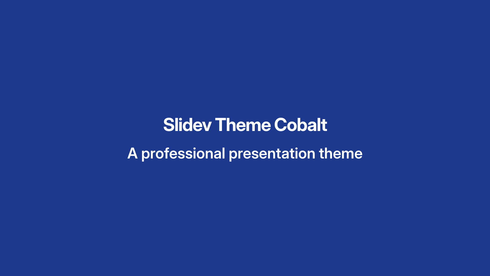
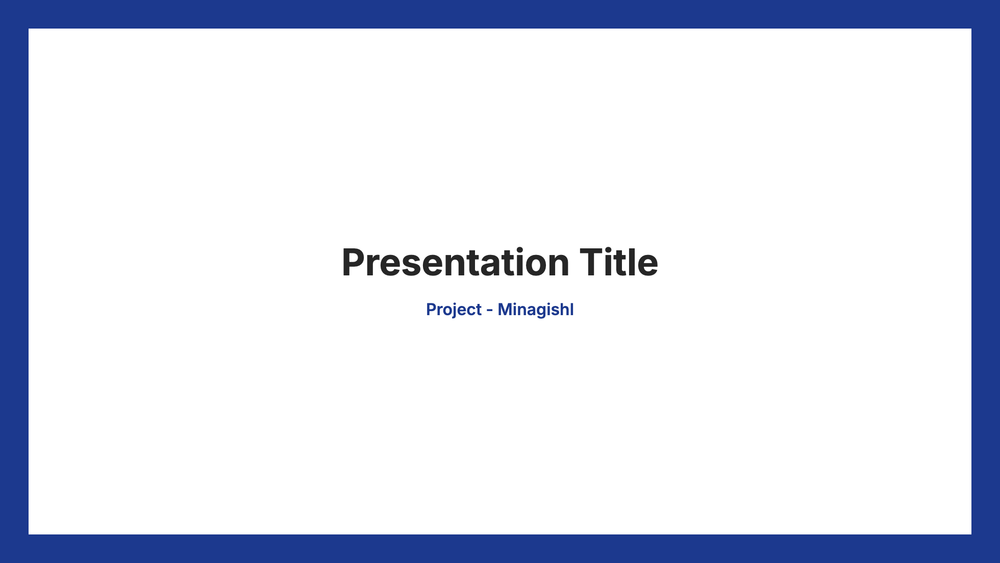

# Slidev Theme Cobalt

A Slidev theme featuring a deep cobalt blue color scheme with framed layouts, inspired by the v2.0 slide template.

## Preview

<table>
<tr>
<td align="center">
  
  <br/>
  <sub>Cover Layout</sub>
</td>
<td align="center">
  
  <br/>
  <sub>Title Center Layout</sub>
</td>
</tr>
</table>

## Live Demo

| Mode       | URL                                     |
| ---------- | --------------------------------------- |
| Slide Show | https://cobalt.minagishl.com            |
| Presenter  | https://cobalt.minagishl.com/presenter/ |

## Install

Add the following frontmatter to your `slides.md`:

```
---
theme: cobalt
---
```

When you run Slidev, it will automatically install the `slidev-theme-cobalt` package.

Learn more about how to use a theme in the Slidev docs.

## Layouts

This theme provides the following layouts:

### Title & Structure

| Layout           | Description                                                                              |
| ---------------- | ---------------------------------------------------------------------------------------- |
| `cover`          | Full blue cover slide with centered content                                              |
| `title`          | Left-aligned title on framed slide                                                       |
| `title-center`   | Centered title on framed slide                                                           |
| `title-sandwich` | Three-part layout with top subtitle, centered title, and bottom footer                   |
| `intro`          | Centered content on framed slide                                                         |
| `section`        | Full blue section divider                                                                |
| `section-frame`  | Framed section divider with white background                                             |
| `section-index`  | Full blue section divider with a large muted number on the left. Accepts a `number` prop |
| `toc`            | Table of contents with numbered badges                                                   |

### Content

| Layout        | Description                                                                                                             |
| ------------- | ----------------------------------------------------------------------------------------------------------------------- |
| `panel`       | Light gray panel for quotes and content. Supports `color`, `align`, and `heading` props                                 |
| `frame-panel` | Framed slide with centered quote. Supports `color` and `align` props                                                    |
| `quote`       | Centered testimonial/blockquote with optional `::source::` slot                                                         |
| `profile`     | Framed profile slide with `::name::` and default slots                                                                  |
| `cols`        | 2 or 3 equal columns. Set `cols: 3` for three columns. Uses `::left::`, `::middle::`, `::right::` slots                 |
| `table`       | Framed layout for Markdown tables                                                                                       |
| `comparison`  | Side-by-side comparison with column titles. Uses `::left::` and `::right::` slots, and `leftTitle` / `rightTitle` props |

### Data & Metrics

| Layout         | Description                                                                                          |
| -------------- | ---------------------------------------------------------------------------------------------------- |
| `stats`        | Large metric cards. Pass a `stats` array with `value`, `label`, and optional `description`           |
| `timeline`     | Horizontal timeline. Pass an `events` array with `date`, `title`, and optional `description`         |
| `steps-layout` | Numbered step list. Pass a `steps` array with `title` and `body`. Supports `start` prop              |
| `process-flow` | Horizontal process flow with circles and arrows. Pass a `steps` array with `title` and `description` |

### Team

| Layout        | Description                                                                    |
| ------------- | ------------------------------------------------------------------------------ |
| `team`        | Grid of team members with images. Pass a `members` array with `name` and `img` |
| `team-border` | Team layout with a blue border                                                 |

### Image

| Layout        | Description                                                                                           |
| ------------- | ----------------------------------------------------------------------------------------------------- |
| `image-left`  | Image on the left, text on the right. Supports `image`, `alt`, and `label` props                      |
| `image-right` | Image on the right, text on the left. Supports `image`, `alt`, and `label` props                      |
| `image-full`  | Full-bleed image inside a frame. Supports `image`, `alt`, `dim`, and `color` (`blue` / `white`) props |

## Components

| Component      | Description                                                                                            |
| -------------- | ------------------------------------------------------------------------------------------------------ |
| `<Label>`      | Corner label. `position` prop: `top-left` (default), `top-right`, `bottom-left`, `bottom-right`        |
| `<Note>`       | Small muted annotation. Same `position` prop as `Label`. Default is `bottom-left`                      |
| `<PageNumber>` | Current page number built on `Label`. `position` prop (default `bottom-right`) and `showTotal` boolean |
| `<Underline>`  | Inline text with a blue underline                                                                      |
| `<QA>`         | Question-and-answer pair. `question` prop for the question text, default slot for the answer           |
| `<NoteBlock>`  | Framed blue note block with icon. `type` prop: `info` (default), `warn`, or `alert`                    |

Components can be placed in any layout:

```markdown
<Label>Table of Contents</Label>
<Note>\* Estimated value</Note>
<PageNumber :showTotal="true" />
<QA question="What is this?">A Slidev theme with cobalt blue design.</QA>
<NoteBlock type="info">
Information
This is an informational note. The second line is optional.
</NoteBlock>
```

## Features

- **Deep Cobalt Blue**: Rich blue color palette (`oklch(37.9% 0.146 265.522)`) for professional presentations
- **Framed Layouts**: Elegant blue frames surrounding white content areas
- **Japanese Support**: Includes Noto Sans JP font for Japanese text
- **Multiple Layouts**: 24 layout options for various presentation needs

## Deploy (Cloudflare Workers)

You can deploy the built slides as static assets to Cloudflare Workers.

1. Log in at [Cloudflare](https://dash.cloudflare.com/) and run `bunx wrangler login` to authenticate (once).
2. Deploy: `bun run deploy` (runs `bun run build` then `wrangler deploy`).
3. After deployment, the slides are available at the shown `*.workers.dev` URL.

Configure the Worker name and options in `wrangler.jsonc` (e.g. edit `name` to change the subdomain).

## Contributing

- `bun install`
- `bun run dev` to start theme preview of `example.md`
- Edit the `example.md` and style to see the changes
- `bun run export` to generate the preview PDF
- `bun run screenshot` to generate the preview PNG

## License

MIT License - See [LICENSE](./LICENSE) file for details.
